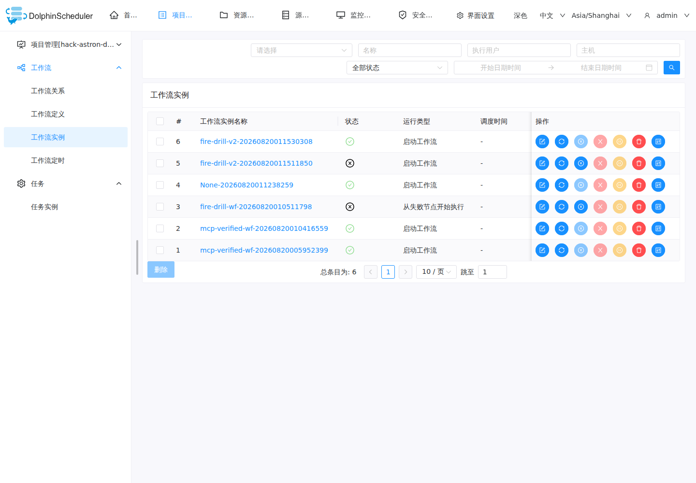
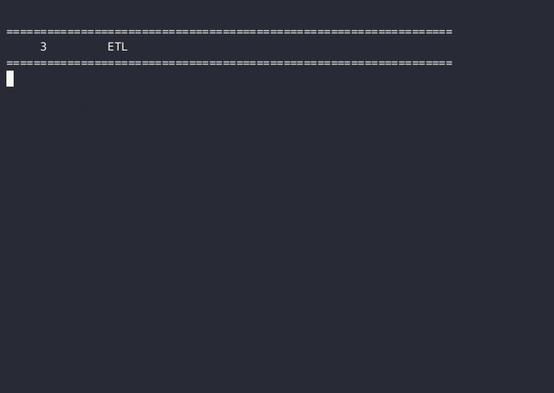
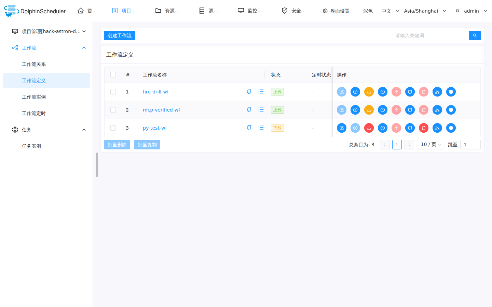

# 凌晨三点，我一句话让 AI 接管了 DolphinScheduler 救火

> 真实使用记录：一台 2C4G 的韩国 VPS 上跑着 DolphinScheduler 3.4.2（standalone）
> 和 dolphin-mcp-pilot 0.3.0（MCP 2.0，HTTP 模式 :8001/mcp/）。
> 所有截图均脱敏，地址/口令已替换为占位符。

## The task

我的日结 ETL 在凌晨 3 点失败了。目标：**不开浏览器、不进 DS 控制台**，
纯靠自然语言让 AI Agent 完成「查失败实例 → 看日志定位原因 → 修复 → 重跑 → 验证」，
并顺手把日常监控用的日报工作流用一句话建起来。

一句话总结：把「打开控制台 + 点点点 + 翻日志」的 15 分钟救火流程，
压缩成 2 分钟的自然语言对话。

## Setup (brief)

- **MCP host**: OpenClaw（同机部署，HTTP 模式接入 dolphin-mcp-pilot）
- **dolphin-mcp-pilot**: 0.3.0（stateless MCP 2.0，53+ 工具）
- **DolphinScheduler**: 3.4.2 standalone（Docker 单容器，内嵌 H2，API 端口 12345）
- **部署形态**: 首尔 VPS，2C4G 内存，DS 内存钳制 1.6G + MCP 源码运行（~100MB），
  swap 1.9G 兜底 —— 极低配环境实测可跑

## What happened

### 场景一：一句话救火（incident firefighting）

**自然语言请求**（凌晨 3 点的告警）：

> 我日结的 ETL 好像挂了，帮我查一下今天凌晨失败的实例，看看是哪个任务、为什么失败，能修复就直接重跑。

**dolphin-mcp-pilot 做了什么**（工具调用链，实测记录）：

1. `ds_get_latest_failure_log` — 一键拉取失败实例日志
   → 命中 fire-drill-v2 实例 id:5（FAILURE），定位故障点 flaky_step（故意 exit 1）
2. `ds_update_task_param` — 直接修脚本（exit 1 → 成功命令）
   → `operations_applied: 1, status: updated`（release_state: ONLINE）
3. `ds_run_workflow` — 触发新运行
   → 实例 id:6，状态 **SUCCESS**（01:15:30 触发、01:15:31 完成）

从「发现失败」到「恢复成功」全程没打开 DS 控制台。

*DS 实例页实测截图：fire-drill-v2 实例 #5（FAILURE）与 #6（SUCCESS）同屏，状态变更一目了然*

**完整救火过程录屏**（32 秒，真实调用非摆拍）：

*从「自然语言请求」到 `ds_list_process_instances` 定位 → `ds_get_latest_failure_log` 看日志 → `ds_update_task_param` 修复 → `ds_run_workflow` 重跑 → SUCCESS 验证，全程真实 MCP 调用链。*

### 场景二：一句话建日报工作流（workflow creation）

**自然语言请求**：

> 帮我建一个每天 08:00 运行的日报工作流：MySQL 拉昨日销售数据 → 汇总 → 推送到企业微信。

**工具调用链**：`ds_create_dag_workflow`（创建 + 上线 ONLINE）→ 设定时 → 验证。

同样在对话里完成，没碰控制台。

## Why it mattered

| 维度 | 手动控制台 | 自然语言 + MCP |
|------|-----------|----------------|
| 时长 | 登录 → 翻实例 → 看日志 → 找按钮重跑，约 15 分钟 | 十分钟内对话完成 |
| 环境 | 必须坐到电脑前开浏览器 | 任何能连 MCP 的地方（手机/终端） |
| 出错面 | 手滑点错任务、重跑错节点 | Agent 按意图选工具，日志可审计 |
| 学习成本 | 要熟悉 DS 控制台每个入口 | 会说话就会用 |

## Published post

- 掘金：<https://juejin.cn/post/7676295909912346633>
- CSDN：待发布（可选）

## Notes / gotchas

- **DS 3.4.2 与旧版 API 不兼容**：`process-definition` → `workflow-definition`、
  `start-process-instance` → `start-workflow-instance`、`process-instances` → `workflow-instances`、
  `processDefinitionCode` → `workflowDefinitionCode`。共打掉 5 处端点 + 17 处字段兼容。
  用 3.4.x 的务必同步这份适配。
- **401 session 缓存坑**：改过认证后要清 session 缓存，否则旧 token 一直 401。
- **低配部署**：2C4G 可以跑通（DS 1.6G 钳制 + MCP 100MB），swap 兜底；全量 docker-compose
  在这类机器上会 OOM，standalone 单容器是正解。
- **写回 payload 会把 name 写坏**：`ds_update_task_param` 写回时若从响应里取 name 而该字段为 null，
  会把工作流名覆盖成 "None"。稳妥做法：name 用 MCP 传入参数兜底，或重建干净工作流再演练（本文即用 v2 复演）。
- **脱敏**：所有截图/配置里的 token、口令、真实 IP 均已打码。
