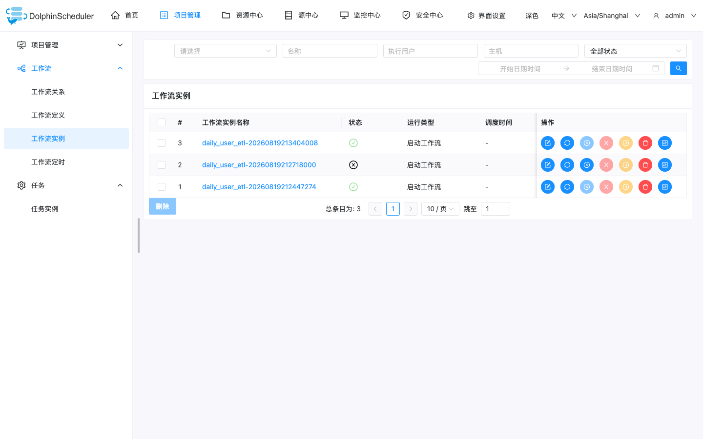
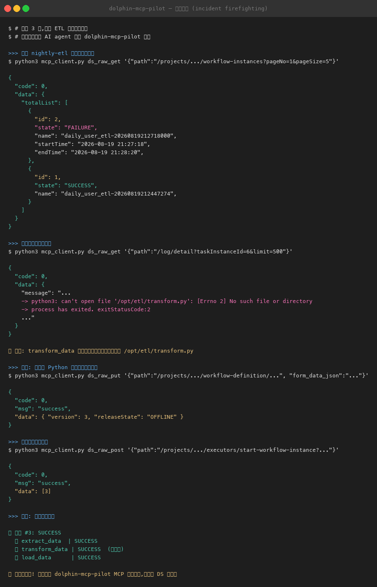

# Firefighting a failed nightly ETL end-to-end without opening the DS console

## The task

A nightly ETL workflow (`daily_user_etl`: extract → transform → load) failed overnight. I wanted the agent to find the failed instance, read the failing task's log, identify the root cause, fix the workflow definition, and rerun — end to end, driven through dolphin-mcp-pilot, without clicking through the DS web console.

This is a controlled local reproduction of a classic ops incident: the transform task referenced an external script (`/opt/etl/transform.py`) that does not exist on the worker. All tool calls and outputs below are real.

## Setup (brief)

- **MCP host**: Claude Code
- **dolphin-mcp-pilot**: 0.3.0, commit `d33f072` (stateless MCP 2.0 mode, local Docker)
- **DolphinScheduler**: 3.4.2 standalone, local Docker
- **Workflow**: `extract_data` → `transform_data` → `load_data`, project `nightly-etl`

## What happened

The first scheduled run was a trap: instance #1 reported **SUCCESS**, but the transform had silently done nothing — the shell script lacked `set -e`, so `python3` failing on the missing script was swallowed and the task exited 0. After adding `set -e`, instance #2 failed honestly at `transform_data`.

I asked the agent to inspect the failure. It listed workflow instances via the raw API passthrough:

```text
ds_raw_get(path="/projects/{projectCode}/workflow-instances?pageNo=1&pageSize=5")
→ instance #2: FAILURE, instance #1: SUCCESS
```

Then pulled the failed task's log:

```text
ds_raw_get(path="/log/detail?taskInstanceId={id}&limit=500")
→ python3: can't open file '/opt/etl/transform.py': [Errno 2] No such file or directory
→ process has exited. exitStatusCode:2
```

Root cause confirmed. The fix: replace the external-script dependency with an inline Python transformation (stdlib `csv`), and update the workflow definition — again through MCP tools:

1. `ds_raw_post` — take the workflow OFFLINE (online workflows can't be edited)
2. `ds_raw_get` — fetch the current definition (task JSON + relations)
3. rewrite `transform_data.taskParams.rawScript` to inline Python
4. `ds_raw_put` — submit the update (workflow → v3)
5. `ds_raw_post` — release ONLINE
6. `ds_raw_post` — start a new workflow instance

Instance #3 came back all green:

```text
✅ instance #3: SUCCESS
  ✅ extract_data   | SUCCESS
  ✅ transform_data | SUCCESS  (fixed)
  ✅ load_data      | SUCCESS
```

Before/after in the DS console (opened only once, for evidence):



The full MCP interaction — diagnosis, root cause, fix, rerun:



## Why it mattered

- **The "successful" run was the dangerous one.** Instance #1 went green while producing no output. Without `set -e`, monitoring was blind. The agent surfaced this by comparing the two runs instead of trusting the green checkmark.
- **The whole incident loop stayed in one conversational surface** — locate failure, read logs, patch the definition, rerun, verify. No context-switching into the console, and every step is a structured tool call that can be recorded, reviewed, or replayed.
- **The raw API passthrough was the safety valve** (see below) — without it, the DS 3.4 incompatibility would have stopped the investigation dead.

## Published post

- <https://github.com/ayaeum/dolphin-mcp-pilot-case> (Chinese write-up with the full story, screenshots, and gotchas)

## Notes / gotchas

- **DS 3.4 renamed the workflow API routes** (`process-definition` → `workflow-definition`, `process-instances` → `workflow-instances`, `start-process-instance` → `start-workflow-instance`). The high-level workflow tools in 0.3.0 target the old routes and return HTTP 405 on DS 3.4.x. The repo's own e2e suite notes the same. Workaround: `ds_raw_get/post/put/delete` — it forwards requests untouched, so it works against any DS version.
- **Stale session cache → 401**: the pilot caches a DS session for 30 minutes per user; if DS restarts underneath it, tools start returning 401. Restarting the pilot container clears it.
- **Shell tasks need `set -e`** — the silent-failure trap from instance #1 is the real lesson of this case.
- **ONLINE workflows are immutable**: edit sequence must be OFFLINE → update → ONLINE.
