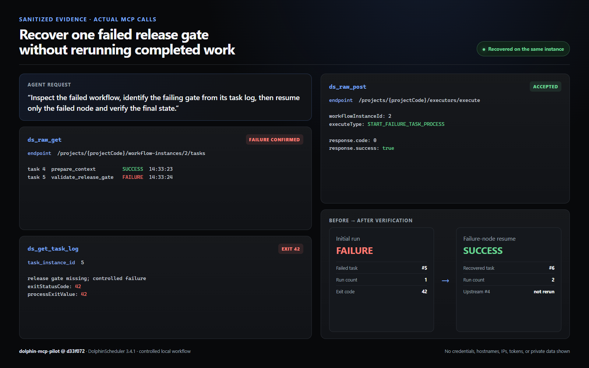

# Recover a failed release gate without rerunning completed work

## The task

I wanted an agent to inspect a failed workflow, identify the failing release gate from the task log, resume only the failed node, and verify that already-completed work was not repeated.

This is a controlled local reproduction, not a production incident. The workflow intentionally fails once when a local readiness marker is absent, then succeeds when the failed node is resumed.

## Setup (brief)

- **MCP host**: OpenAI Codex (`host: other`)
- **dolphin-mcp-pilot**: commit `d33f072` (unmodified upstream source during the recorded run)
- **DolphinScheduler**: 3.4.1 standalone, bound to localhost
- **Workflow**: `prepare_context` → `validate_release_gate`

DolphinScheduler 3.4 does not bundle task plugins in the standalone image. I installed the official Apache Shell task-plugin artifact before running the case. No application source change was needed for that step.

## What happened

The agent request was:

> Inspect the failed workflow, identify the failing gate from its task log, then resume only the failed node and verify the final state.

The first run created workflow instance `2` and ended in `FAILURE`:

- task `4`, `prepare_context`: `SUCCESS` at `14:33:23`
- task `5`, `validate_release_gate`: `FAILURE` at `14:33:24`

`ds_get_task_log(task_instance_id=5)` exposed the real failure signal:

```text
release gate missing; controlled failure
exitStatusCode: 42
processExitValue: 42
```

The high-level instance helpers in this tested commit target the older `process-*` routes. DolphinScheduler 3.4 uses `workflow-*` routes, so I used dolphin-mcp-pilot's documented raw API passthrough as the compatibility safety valve instead of modifying the server:

```text
ds_raw_post(
  path="/projects/{projectCode}/executors/execute",
  data={
    "workflowInstanceId": 2,
    "executeType": "START_FAILURE_TASK_PROCESS"
  }
)
```

The API returned `code: 0` and `success: true`. A follow-up `ds_raw_get` showed:

- workflow instance `2`: `SUCCESS`
- `runTimes`: `2`
- command type: `START_FAILURE_TASK_PROCESS`
- task `6`, `validate_release_gate`: `SUCCESS` at `14:33:48`
- task `4`, `prepare_context`: still timestamped `14:33:23`

The unchanged upstream-task timestamp is the evidence that the successful preparation node was not rerun.

`ds_get_task_log(task_instance_id=6)` then confirmed:

```text
release gate present; recovery succeeded
exitStatusCode: 0
processExitValue: 0
```



## Why it mattered

The useful behavior was not merely changing the workflow from red to green. The agent preserved the successful upstream work, retrieved the exact failed-task log, selected the failure-only recovery command, and verified both the final workflow state and task-level execution history.

The raw passthrough also provided a practical escape hatch when the server's typed helpers and the target DolphinScheduler version used different route names.

## Published post

- <https://gist.github.com/dj331/1d9eb6d642381a1779741d25e80508c0>

## Notes / gotchas

- From DolphinScheduler 3.3 onward, task plugins are not bundled; install the plugin required by the workflow.
- Use the raw API passthrough only with an endpoint and parameter contract verified against the target DolphinScheduler version.
- All identifiers shown here belong to an isolated local test. Credentials, tokens, hostnames, IPs, filesystem log paths, and private data were omitted.
