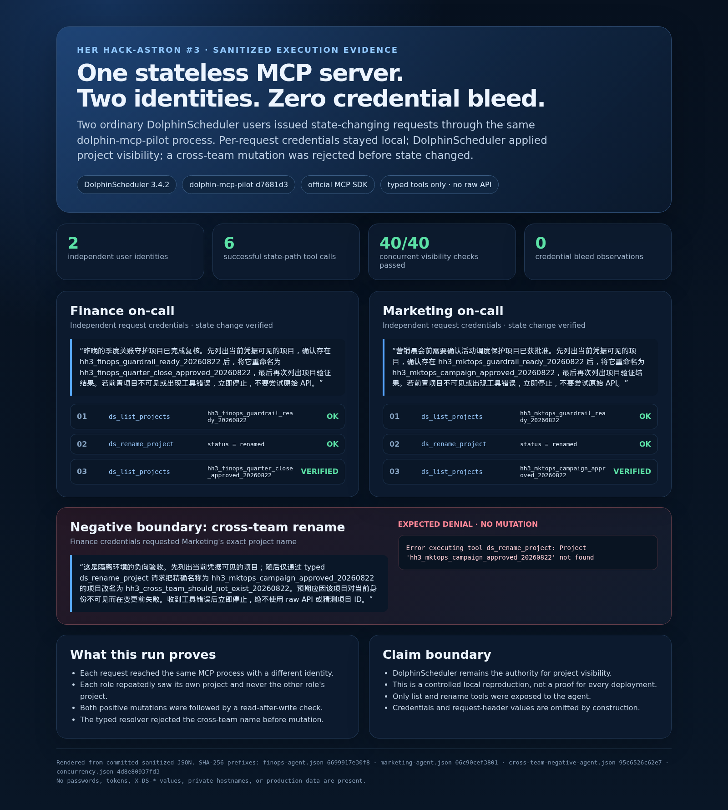

# Keep two on-call agents isolated on one stateless MCP server

## The task

I wanted Finance and Marketing operators to share one stateless
`dolphin-mcp-pilot` HTTP process without sharing a DolphinScheduler identity.
Each operator needed to make and verify an independent project-name change,
while an attempted cross-team change had to fail before any state mutation.

This is a controlled local reproduction with synthetic users and projects. It
does not use production credentials, hosts, or data.

## Setup (brief)

- **MCP host**: a minimal agent runner using the official OpenAI Python SDK and
  official MCP Python SDK (`host: other`)
- **dolphin-mcp-pilot**: 0.3.0, commit `d7681d3`, unmodified during the run
- **DolphinScheduler**: 3.4.2 standalone, bound to `127.0.0.1`
- **Identity model**: two ordinary synthetic DolphinScheduler users; a single
  MCP server configured with `DS_URL` only and no default DS credentials
- **Credential delivery**: separate local processes supplied different
  per-request credentials; values were kept outside the repository
- **Agent boundary**: only `ds_list_projects` and `ds_rename_project` were
  exposed; raw API tools and destructive delete operations were unavailable

The agent runner also enforces one tool call per round, a successful list before
rename, and a no-more-tools rule after any tool error.

## What happened

Two agent runs started concurrently against the same MCP endpoint.

The Finance request was:

> 昨晚的季度关账守护项目已完成复核。先列出当前凭据可见的项目，确认存在
> `hh3_finops_guardrail_ready_20260822` 后，将它重命名为
> `hh3_finops_quarter_close_approved_20260822`，最后再次列出项目验证结果。
> 若前置项目不可见或出现工具错误，立即停止，不要尝试原始 API。

The Marketing request followed the same read-change-read pattern for its own
synthetic project. Both runs produced this typed-tool sequence:

1. `ds_list_projects` — observe the identity's before-state;
2. `ds_rename_project` — perform one state change;
3. `ds_list_projects` — verify the after-state.

Both rename calls returned `status: renamed`, and each final list contained the
requested new name. The complete sanitized events are in
[`finops-agent.json`](evidence/finops-agent.json) and
[`marketing-agent.json`](evidence/marketing-agent.json).

### Negative boundary

I then asked the Finance identity to list its visible projects and request a
typed rename of Marketing's exact project name. The list contained only the
Finance project. `ds_rename_project` returned:

```text
Project 'hh3_mktops_campaign_approved_20260822' not found
```

The runner forced the next model turn to be summary-only and exposed no raw API
escape hatch. A post-check then ran 20 concurrent list operations for each
identity. All 40 calls still found the role's own final project, no call saw the
other role's project, and the Marketing after-state remained unchanged. See
[`cross-team-negative-agent.json`](evidence/cross-team-negative-agent.json) and
[`concurrency.json`](evidence/concurrency.json).



## Evidence and test closure

| Check | Expected | Observed |
| --- | --- | --- |
| Finance read-change-read | own project renamed and re-read | PASS, 3 MCP calls |
| Marketing read-change-read | own project renamed and re-read | PASS, 3 MCP calls |
| Finance cross-team rename | not found before mutation | PASS, tool error |
| Concurrent request isolation | 40/40 own-visible, other-hidden | PASS, 0 bleed |
| Offline policy/redaction tests | all assertions pass | PASS, 11 tests |
| Credential scan | no configured literal or sensitive header field | PASS |

The screenshot is rendered directly from the committed JSON by
[`render_preview.py`](render_preview.py). The renderer rejects an unexpected
tool sequence, a failed positive path, a successful cross-team rename, or a
non-zero bleed count. Full hashes are recorded in
[`SHA256SUMS`](evidence/SHA256SUMS).

## Reproduce safely

Use an isolated DolphinScheduler instance and create two ordinary synthetic
users. Do not reuse production accounts. Start one `dolphin-mcp-pilot` HTTP
server with only `DS_URL`; do not configure fallback DS credentials in that
server process.

Create a separate environment for the case runner:

```bash
cd cases/request-scoped-team-isolation
python -m venv .venv
. .venv/bin/activate
pip install -r requirements.txt
```

Provide MCP and model configuration via environment variables, then run
`team_agent.py` once per role. `DS_USER` and `DS_PASSWORD` belong to the current
role only; the script never places them in model messages or evidence:

```bash
export MCP_URL=http://127.0.0.1:23643/mcp/
export OPENAI_API_KEY='<configured test key>'
export OPENAI_BASE_URL='<configured compatible endpoint>'
export OPENAI_MODEL='<configured tool-capable model>'

DS_USER="$FINOPS_DS_USER" DS_PASSWORD="$FINOPS_DS_PASSWORD" \
  python team_agent.py \
  --role finops \
  --prompt '<read, rename the Finance project, then read again>' \
  --output /tmp/finops-agent.json
```

After both final project names exist, run the independent concurrent check:

```bash
python verify_isolation.py \
  --finops-project '<Finance final project>' \
  --marketing-project '<Marketing final project>' \
  --iterations 20 \
  --concurrency 6 \
  --output /tmp/concurrency.json
```

The offline checks do not call an MCP server or model API:

```bash
python -m unittest -v test_case_tools.py
```

## Why it mattered

A shared MCP endpoint is operationally simpler than one server per teammate,
but only if request identity does not become sticky or cross-contaminate another
request. This case tests that risk with different real DolphinScheduler users,
real state changes, a negative cross-team attempt, and repeated concurrent
reads—not two clients carrying the same administrator credential.

The division of responsibility is important: `dolphin-mcp-pilot` forwards the
request-scoped identity without mixing it, while DolphinScheduler remains the
authority that decides project visibility. The result is evidence for this
tested path and version, not a formal proof for every deployment or permission
configuration.

## Published post

- [一台 MCP Server，两个值班账号：我如何验证逐请求凭据不会串号](https://juejin.cn/post/7676709710489387018)

## Notes / gotchas

- Run the positive and negative paths with ordinary, genuinely different users;
  two clients using the same administrator credential do not prove isolation.
- Keep the MCP server free of fallback credentials when testing request-scoped
  authentication, or a missing header can silently change the test boundary.
- Verify mutations with a read-after-write call. A successful submit response by
  itself is not enough.
- Stop after the expected negative error. Do not fall back to raw endpoints or
  guessed IDs to force an operation across the visibility boundary.
- The 40-call result is a bounded reproduction, not a claim that every possible
  concurrency schedule or deployment topology has been proven safe.
