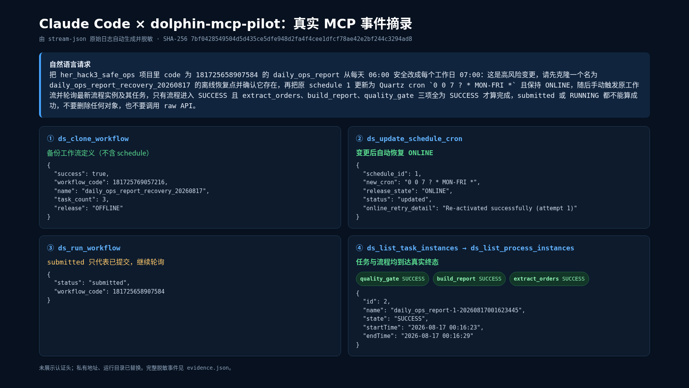
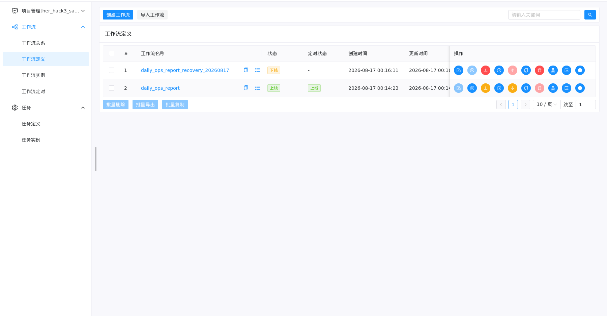
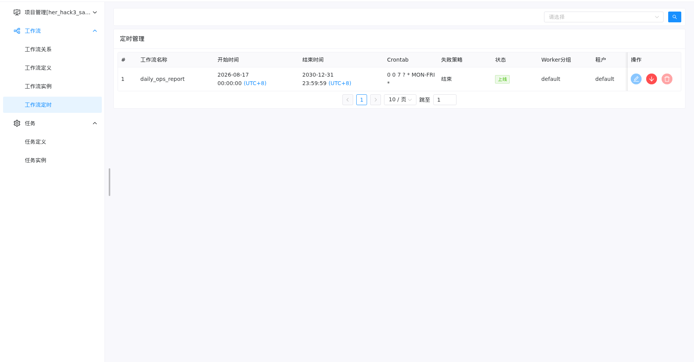
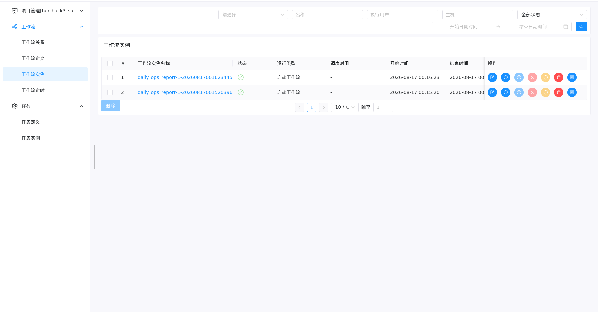
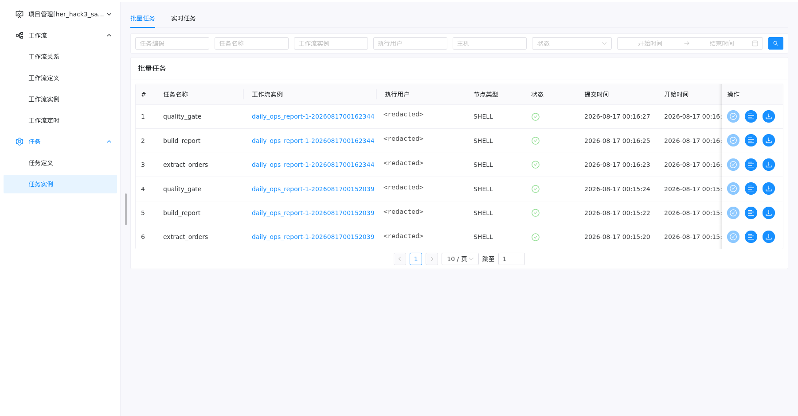

# 一句话安全改调度：先备份工作流定义，再验收到真实 SUCCESS

## The task

我需要把 `daily_ops_report` 从每天 06:00 改为工作日 07:00，又不希望一次错误的自然语言操作留下不可逆影响。验收条件不是“命令已提交”，而是：变更前存在一个离线的工作流定义副本、调度更新后保持在线、原工作流和三项任务都到达 `SUCCESS`。

## Setup (brief)

- **MCP host**: Claude Code 2.1.232
- **dolphin-mcp-pilot**: `18aa99d` (`v0.3.0-3-g18aa99d`)
- **DolphinScheduler**: 3.2.2 官方 standalone，本地合成数据，仅监听 loopback
- **Workflow**: `extract_orders → build_report → quality_gate`，三个无业务数据的 SHELL 节点

在正式变更前，我独立跑过一次基线：schedule 1 为 `0 0 6 * * ? *` / `ONLINE`，流程实例和三个任务均为 `SUCCESS`。

## What happened

我给 Claude Code 的请求只有一句，但把安全边界和验收标准写清楚了：

> 把 `her_hack3_safe_ops` 项目里 code 为 `181725658907584` 的 `daily_ops_report` 从每天 06:00 安全改成每个工作日 07:00：这是高风险变更，请先克隆一个名为 `daily_ops_report_recovery_20260817` 的离线恢复点并确认它存在，再把原 schedule 1 更新为 Quartz cron `0 0 7 ? * MON-FRI *` 且保持 ONLINE，随后手动触发原工作流并轮询最新流程实例及其任务，只有流程进入 SUCCESS 且三项任务全为 SUCCESS 才算完成，submitted 或 RUNNING 都不能算成功，不要删除任何对象，也不要调用 raw API。

这里的“恢复点”是当时请求中的原话。按工具的真实语义，它只是离线的工作流定义副本，不是 schedule 快照，也不包含旧 cron。

下面的主图由 Claude Code 的真实 `stream-json` 事件自动生成并脱敏，不是手工编写的对话截图。原始事件 SHA-256、逐项 MCP 参数和结果可在 [`evidence/evidence.json`](evidence/evidence.json) 中核对，生成方式见 [`scripts/render_evidence.py`](scripts/render_evidence.py)。

智能体的执行链如下：

1. `ds_get_workflow` 确认原工作流；调度基线来自正式变更前的独立检查。本轮 `ds_list_schedules` 事件没有返回可用结果，因此不把它作为基线证据。
2. `ds_clone_workflow(auto_online=false)` 创建工作流定义副本；`ds_list_workflows` 再次确认其为 `OFFLINE`。
3. `ds_update_schedule_cron(auto_online=true)` 将 cron 更新为工作日 07:00，并在更新后重新上线。
4. `ds_run_workflow` 返回 `submitted` 后继续查询，而不是提前宣布成功。
5. 最新实例先处于 `RUNNING_EXECUTION`；`ds_list_task_instances` 随后显示三项任务均为 `SUCCESS`。
6. 最后一次 `ds_list_process_instances` 确认流程实例 id 2 也进入 `SUCCESS`。

控制台给出了同一轮操作的第二组证据：

最终状态：

| Check | Result |
| --- | --- |
| Workflow-definition backup | `daily_ops_report_recovery_20260817`, `OFFLINE`, 3 tasks |
| Schedule | `0 0 7 ? * MON-FRI *`, `ONLINE` |
| Process instance | id 2, `SUCCESS` |
| Tasks | `extract_orders`, `build_report`, `quality_gate` all `SUCCESS` |
| Deletions / raw API in the core request | none |

## Why it mattered

这次节省的不是几次页面点击，而是把操作顺序变成了可检查的安全协议：先备份工作流定义，再执行状态变更，最后同时验证任务终态和流程终态。定义副本为工作流内容提供了独立副本；旧 cron 则必须依靠变更前记录的基线重新写回。即使触发接口返回 `submitted`，智能体也不会把排队成功误报成执行成功。

## Published post

- <https://github.com/whyiug/her-hack-astron-3-safe-schedule>

## Notes / gotchas

- **恢复边界**：`ds_clone_workflow` 复制的是工作流定义、任务和依赖关系，不包含 schedule。本案例没有演示自动调度回滚；如需回退，应把 schedule 1 重新更新为基线 cron `0 0 6 * * ? *`，保持 `ONLINE`，并再次验证终态。因此这里证明的是“工作流定义备份 + 调度变更 + 终态验收”，不是“副本能够恢复旧 cron”。
- DolphinScheduler 3.2.2 对 task definition 要求显式的 `isCache`。当前版本的 `ds_create_dag_workflow` 初始化这组练习数据时返回 `request parameter {0} is not valid`；服务端调用栈显示缺失值在任务关系转换中触发空指针。为保持叙述诚实，我只在**测试数据初始化**阶段通过 raw API 补了 `isCache=NO`，核心的一句话变更未使用 raw API。
- `ds_run_workflow` 的 `submitted` 只是受理状态。可靠闭环需要继续轮询 task instance 和 process instance，直到两层都进入真实终态。
- 所有内容均来自本地合成实例；认证头从未进入提交材料，私网地址和运行路径已由渲染脚本替换。控制台截图只做了确定性隐私处理：裁去顶部登录区，并把任务执行用户替换为 `<redacted>`；cron、状态和时间等证据字段未改动。
- 文章根据真实日志整理，并使用 Codex 辅助结构化和脱敏检查；操作记录、工具结果和截图均来自上述实测。
