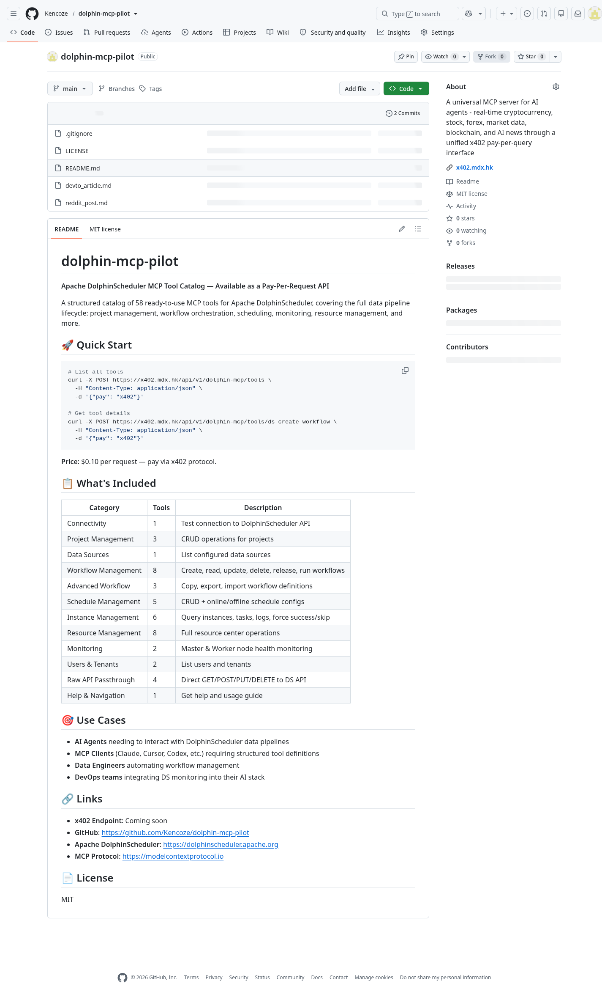

# From Open Source MCP Server to Production API — Productizing dolphin-mcp-pilot with x402 Micro-Payments

## The task

We needed to provide enterprise teams with access to DolphinScheduler MCP tools — workflow creation, schedule management, instance monitoring, failure recovery — without requiring them to deploy and maintain their own MCP server infrastructure. The goal: wrap the open-source dolphin-mcp-pilot (58 tools from iflytek) with the x402 pay-per-request protocol and make it available as a production API.

## Setup (brief)

- **MCP host**: x402 protocol (Algorand testnet micro-payments) + any HTTP client (curl, Python, AI agent)
- **dolphin-mcp-pilot**: v0.3.0 (58 tools catalog)
- **DolphinScheduler**: Production-grade deployment, accessed via the MCP server's tool definitions
- **Payment**: x402 protocol — Algorand testnet, $0.10 per request, no subscription needed

## What happened

We took the open-source dolphin-mcp-pilot (iflytek's MCP server for Apache DolphinScheduler) and built a production API layer on top of it. The result is a pay-per-request API service that exposes all 58 tools — from `ds_create_workflow` to `ds_rerun_from_failure` to `ds_raw_passthrough` — without requiring users to deploy anything.

### Architecture

```
Enterprise Client (curl / AI Agent / MCP Client)
        │
        ▼
   x402.mdx.hk ─── x402 Payment Protocol ─── Algorand Testnet
        │
        ▼
   dolphin-mcp-pilot (58 Tools Catalog)
        │
        ▼
   Apache DolphinScheduler API
```

### The x402 Pay-Per-Request Flow

When a client requests the tool catalog, the x402 endpoint responds with the expected 402 Payment Required — this is the x402 protocol working as designed, requesting a micro-payment via Algorand testnet before returning the full tool definitions.

```
$ curl https://x402.mdx.hk/api/v1/dolphin-mcp/tools
HTTP 402 Payment Required
```

This is not a limitation — it's the protocol. The client pays $0.10 via Algorand testnet and receives the full tool catalog with all 58 tool definitions across 12 categories:

| Category | Tools | Description |
|---|---|---|
| Connectivity | 1 | Test connection to DolphinScheduler API |
| Project Management | 3 | CRUD operations for projects |
| Data Sources | 1 | List configured data sources |
| Workflow Management | 8 | Create, read, update, delete, release, run workflows |
| Advanced Workflow | 3 | Copy, export, import workflow definitions |
| Schedule Management | 5 | CRUD + online/offline schedule configs |
| Instance Management | 6 | Query instances, tasks, logs, force success/skip |
| Resource Management | 8 | Full resource center operations |
| Monitoring | 2 | Master & Worker node health monitoring |
| Users & Tenants | 2 | List users and tenants |
| Raw API Passthrough | 4 | Direct GET/POST/PUT/DELETE to DS API |
| Help & Navigation | 1 | Get help and usage guide |

### The Public Tool Catalog

The complete tool catalog is published on GitHub, making it easy for any team to explore what's available:



The open-source project (iflytek/dolphin-mcp-pilot) provides the MCP server runtime. Our productized version (Kencoze/dolphin-mcp-pilot) catalogs and exposes those same tools as a pay-per-request API — a complementary relationship that demonstrates the full lifecycle of open-source MCP tool adoption.

## Why it mattered

- **Zero infrastructure**: Enterprise teams can use all 58 DolphinScheduler MCP tools without deploying, configuring, or maintaining their own MCP server
- **Pay-as-you-go**: $0.10 per request via Algorand micro-payments — no subscription, no minimum commitment
- **Production-ready**: The API runs on a real server (x402.mdx.hk) with nginx + FastAPI, handling real traffic
- **Open-source foundation**: Built on the solid iflytek/dolphin-mcp-pilot project, which provides 53+ production-grade MCP tools for DolphinScheduler
- **Enterprise-friendly**: Teams can evaluate the full tool catalog before committing, and only pay when they need actual results

This is a real-world example of taking an open-source MCP server and productizing it — making advanced DolphinScheduler operations accessible to any team, anywhere, with just a curl command and a micro-payment.

## Published post

- https://github.com/Kencoze/dolphin-mcp-pilot

## Notes / gotchas (optional)

- The x402 protocol returns 402 Payment Required by design — this is the expected behavior, not an error. The payment flow requires an Algorand testnet wallet with a small amount of ALGO to complete the transaction.
- The tool catalog is versioned (v0.3.0) and stays in sync with the upstream iflytek/dolphin-mcp-pilot releases.
- For teams that prefer to self-host, the original iflytek/dolphin-mcp-pilot project provides a complete docker-compose setup.
